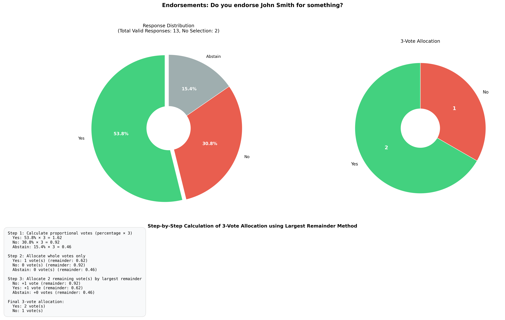

# Survey Results Analysis



*Example output showing response distribution, vote allocation, and step-by-step calculation using the largest remainder method.*

This script analyzes survey results from a CSV file, calculates the percentage of votes for each answer (excluding "No Selection" options), visualizes these percentages, and determines how to allocate 3 votes proportionally.

## Requirements

- Python 3.6+
- Dependencies listed in `requirements.txt`

## Installation

1. Clone this repository or download the files
2. Install the required dependencies:

```bash
pip install -r requirements.txt
```

## Usage

To analyze survey results, run:

```bash
python analyze_survey.py <csv_file_path> [output_directory]
```

Arguments:
- `csv_file_path`: Path to the CSV file containing survey data
- `output_directory` (optional): Directory where plot images will be saved (default: 'plots')

### Examples:

Basic usage with default output directory:
```bash
python analyze_survey.py example_survey.csv
```

Specifying a custom output directory:
```bash
python analyze_survey.py example_survey.csv my_results
```

## Example Data

The repository includes an `example_survey.csv` file that demonstrates the expected format and can be used to test the script:

```bash
python analyze_survey.py example_survey.csv
```

## Output

The script will:

1. For each question in the survey:
   - Calculate the percentage of votes for each answer (excluding "No Selection")
   - Determine the optimal allocation of 3 votes based on these percentages
   - Print the results in the console
   - Create a visualization in the specified output directory

2. The visualizations include:
   - A pie chart showing the percentage of each answer
   - A pie chart showing how 3 votes should be allocated
   - A detailed step-by-step calculation of the vote allocation

## Vote Allocation Method

The script uses the largest remainder method to allocate 3 votes [Quota method Wikipedia](https://en.wikipedia.org/wiki/Quota_method):

1. Calculate the proportion of votes each answer should receive
2. Allocate whole votes first
3. Distribute remaining votes based on the largest remainder

This ensures the most accurate representation of the survey results when using only 3 votes. The calculation steps are shown directly on each visualization. 
